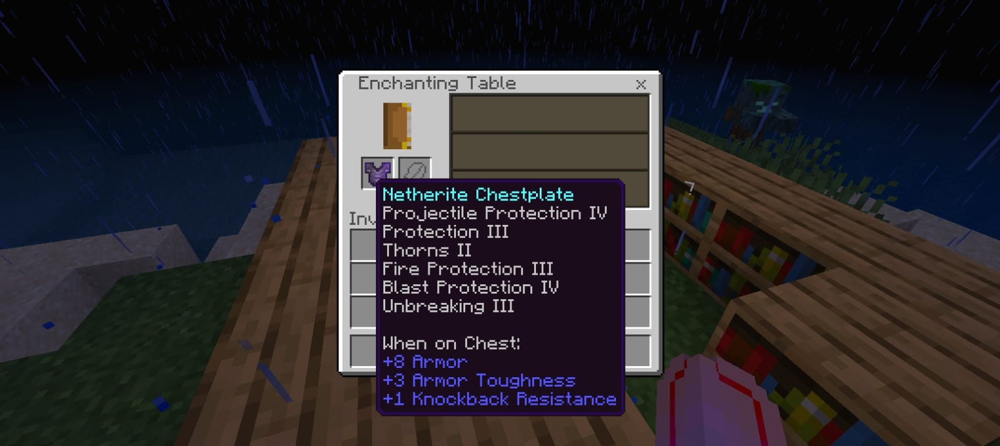

# ✨ EnchantLimitLess

A lightweight mod that breaks the vanilla barriers, allowing you to create the ultimate god-tier gear. No more choosing between power and utility—have it all.

---

### 🛡️ Core Features
* **Ultimate Protection:** Stack Protection, Projectile Protection, Fire Protection, and Blast Protection all on one piece.
* **The God Sword:** Stack **Sharpness**, **Bane of Arthropods**, and **Smite** on a single sword.
* **The God Table:** Enchantment tables now grant these "conflicting" combos naturally.
* **Perfect Bows:** Run **Mending** and **Infinity** together for infinite power that never breaks.
* **True Crossbows:** Combine **Piercing** and **Multishot** for ultimate crowd control.

* **Customizeable Max Level and Cost Enchant**

---



---

### ⚠️ Heads Up: Useless Combos
While you *can* put these together now, some enchants just don't work side-by-side. To keep things stable, the mod blocks these combinations from occurring:

* **Fortune is disabled by Silk Touch:** You can't get extra drops from a block that hasn't been broken. Silk Touch takes priority, so your Fortune levels won't do anything.
* **Channeling is disabled by Riptide:** You can't strike a mob with lightning if you're busy launching yourself into the air.
* **Loyalty is disabled by Riptide:** There is no point in the trident "returning" to you if you never actually let go of it. 

---

### ⚙️ Total Freedom

* **Configure the feature at:**
```
/storage/emulated/0/Android/media/{ambient package}/modules/EnchantLimitLess/config.json
```

change the enchantment.freedom to true

## ⚙️ Requirements

- 🚀 [Ambient](https://ambient.kitsuri.dev)

## 🛠️ Installation

- Install Ambient
- Import EnchantLimitLess mod in Ambient by doing "Manage Mods > Add Mod"
- Launch Minecraft with the mod activated

## 📜 License
- This project is licensed under All Rights Reserved.
- Originally Made By [TANGY009](https://github.com/Tangy009)
